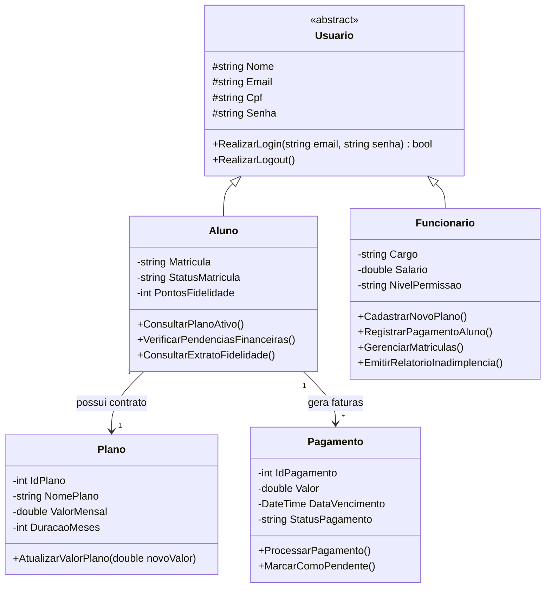

# Modelagem do Sistema - PulseGym

Esta seção apresenta a estrutura estática do sistema **NexusFit** sob a ótica da Orientação a Objetos. O desenho foi concebido para suportar dois perfis distintos de acesso através de um módulo de autenticação unificado: **Clientes (Alunos)** e **Administradores (Funcionários)**. 

Abaixo encontra-se o diagrama de classes em UML, seguido da listagem detalhada das responsabilidades de cada entidade e da explicação dos seus relacionamentos.

---

## 1. Diagrama de Classes (UML)

##2.2. Classes e Suas Responsabilidades

Usuario (Classe Base / Abstrata):

Papel: Representa o conceito genérico de qualquer pessoa cadastrada no sistema. Concentra os atributos fundamentais de identificação (Nome, Email, Cpf, Senha) e o comportamento padrão de segurança (RealizarLogin).

Aluno (Especialização de Usuário - Painel do Cliente):

Papel: Modela o aluno matriculado. Possui atributos próprios como Matricula, StatusMatricula e PontosFidelidade. Na tela do cliente, é responsável por carregar as informações exclusivas do frequentador (como extrato de pontos e histórico do plano).

Funcionario (Especialização de Usuário - Painel do Administrador):

Papel: Modela a equipe interna da academia. Possui atributos corporativos (Cargo, Salario, NivelPermissao). Na tela administrativa, capacita o operador a gerenciar cadastros, baixar pagamentos e configurar o sistema.

Plano:

Papel: Modela os pacotes de serviços comercializados (ex: Mensalidade, Trimestral). Armazena o valor, a duração e as regras de vigência, sendo exibido tanto no painel do aluno quanto nas opções de gestão do administrador.

Pagamento:

Papel: Modela as faturas e transações financeiras geradas para os alunos. Controla o valor, a data de vencimento e o status atual (Pago ou Pendente), alimentando o módulo de controle de pendências.
