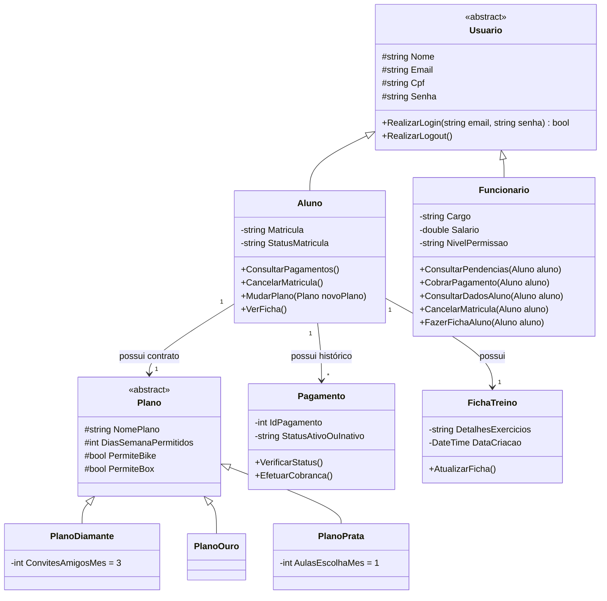

# Modelagem do Sistema - NexusFit

Esta seção apresenta a estrutura estática do sistema **NexusFit** sob a ótica da Orientação a Objetos. O desenho foi concebido para suportar dois perfis distintos de acesso através de um módulo de autenticação unificado: **Clientes (Alunos)** e **Administradores (Funcionários)**. 

Abaixo encontra-se o diagrama de classes em UML, seguido da listagem detalhada das responsabilidades de cada entidade e da explicação dos seus relacionamentos.

---

## 1. Diagrama de Classes (UML)

## 2.2. Classes e Suas Responsabilidades

Usuario (Classe Abstrata Base):

Papel: Concentra os atributos genéricos de autenticação (Nome, Email, Cpf, Senha) e o método comum de login para validar o acesso no sistema.

Aluno (Perfil Cliente - Herda de Usuario):

Papel: Representa o aluno da academia. Possui atributos de identificação como Matricula e StatusMatricula. Suas funcionalidades incluem escolher/mudar de plano, consultar pagamentos, verificar o status da matrícula, cancelar o plano e visualizar a ficha de treino.

Funcionario (Perfil Administrador - Herda de Usuario):

Papel: Representa a equipe gestora. Suas funcionalidades englobam consultar pendências (verificando se o status está ativo ou inativo), efetuar cobranças, consultar os dados cadastrais completos dos alunos (nome, e-mail, CPF, senha e matrícula), cancelar matrículas e criar ou atualizar a ficha de treino do aluno.

Plano (Hierarquia de Planos):

Papel: Classe base abstrata para os pacotes de treino. Suas especializações definem as regras específicas de cada categoria:

PlanoDiamante: Acesso 7 dias por semana, aulas de bicicleta, aulas de box e direito a levar 3 amigos por mês.

PlanoOuro: Acesso 7 dias por semana, aulas de bicicleta e aulas de box.

PlanoPrata (Básico): Acesso 5 dias por semana e direito a 1 aula por mês de livre escolha.

Pagamento:

Papel: Controla a situação financeira da mensalidade, permitindo verificar se o status está ativo ou inativo e disparar cobranças.

FichaTreino:

Papel: Armazena os dados dos exercícios recepcionados e montados pelo funcionário para acompanhamento do aluno.

## 2.3. Relacionamentos entre as Classes

Herança: As classes Aluno e Funcionario herdam de Usuario. Da mesma forma, os tipos de planos (PlanoDiamante, PlanoOuro, PlanoPrata) herdam de Plano.

Associação: O Aluno possui um Plano ativo, um histórico de Pagamento e uma FichaTreino associada, enquanto o Funcionario interage diretamente gerindo os dados e pendências do aluno.
